# Shrine Specialist Pack - Mod
This mod adds Specialists with focus on the Shrines into Anno 117. This Mod is part as a submod of "Extended Specialists Mod".
***

### Specialists Overview (with help of AI Generated - manually revisited - might still contain Issues)
***

### Rare
| Image Preview | GUID | Internal Name | Itemname | Description | Targets | Base Effects |
| :---: | :---: | :---: | :---: | :---: | :---: | :---: |
| 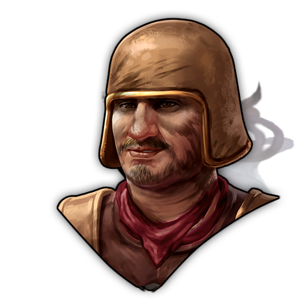 | 1600000388 | Specialist AE-FiresafetyAllShrines-R | Blessed Vigiles | Has himself blessed before every deployment to a fire. (Shrine-Pack) | All Shrines | • +1 FireSafety |
|  | 1600000392 | Specialist AE-HappinessAllShrines-R | Blessed Custodes | Keeps the Streets safe with the blessing of the gods. (Shrine-Pack) | All Shrines | • +1 Happiness |
|  | 1600000396 | Specialist AE-HealthAllShrines-R | Smelling Shrine Visitor | Hopes for a divine blessing to remove her smell. (Shrine-Pack) | All Shrines | • +1 Health |
| 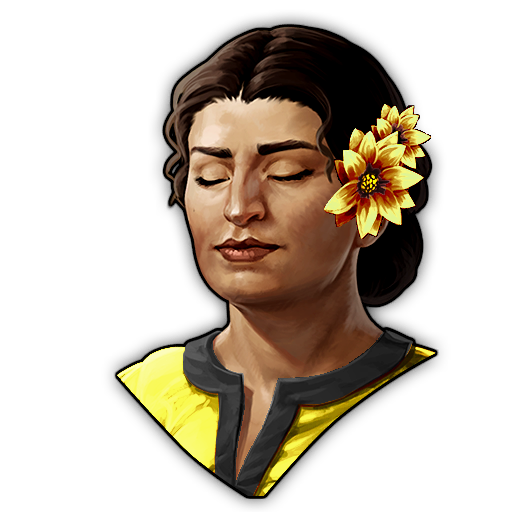 | 1600000329 | Specialist AE-MinorCeresShrine-R | Follower of Ceres | Prays at the shrine to find the blessing of Ceres. (Shrine-Pack) | All Ceres Shrines | Area Effect: • +1 Health • +1 Population |
| 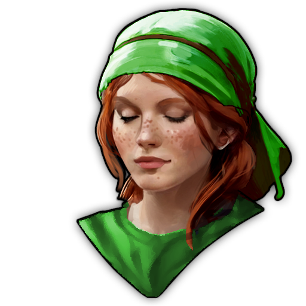 | 1600000333 | Specialist AE-MinorCernunnosShrine-R | Follower of Cernunnos | Prays at the shrine to find the blessing of Cernunnos. (Shrine-Pack) | All Cernunnos Shrines | Area Effect: • +1 Health  • +1 Belief |
| 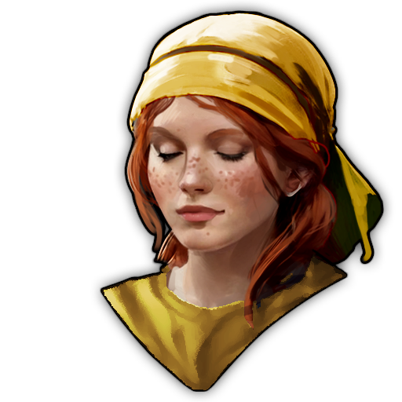 | 1600000337 | Specialist AE-MinorEponaShrine-R | Follower of Epona | Prays at the shrine to find the blessing of Epona. (Shrine-Pack) | All Epona Shrines | Area Effect: • +1 Happiness • +1 Population |
| 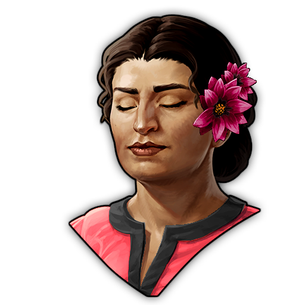 | 1600000341 | Specialist AE-MinorMarsShrine-R | Follower of Mars | Prays at the shrine to find the blessing of Mars. (Shrine-Pack) | All Mars Shrines | Area Effect: • +1 Prestige • +1 Population |
| 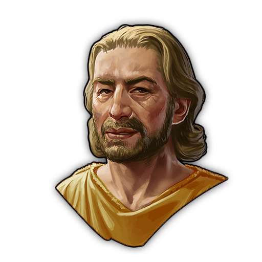 | 1600000345 | Specialist AE-MinorMercuryShrine-R | Follower of Mercury-Lugus | Prays at the shrine to find the blessing of Mercury-Lugus. (Shrine-Pack) | All Marcury-Lugus Shrines | Area Effect: • +2 Money |
| 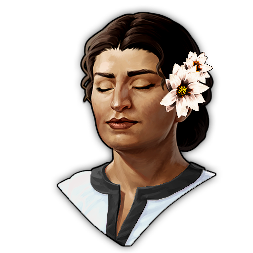 | 1600000349 | Specialist AE-MinorMinervaShrine-R | Follower of Minerva | Prays at the shrine to find the blessing of Minerva. (Shrine-Pack) | All Minerva Shrines | Area Effect: • +1 Prestige • +1 Knowledge |
| 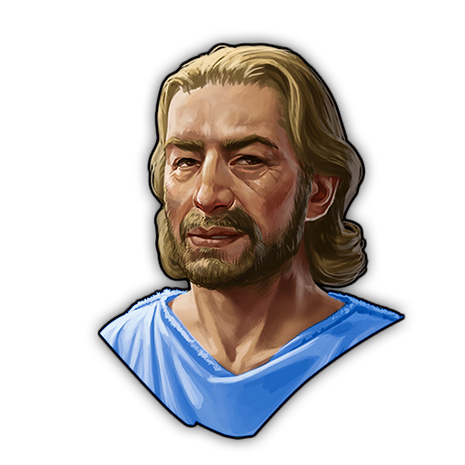 | 1600000353 | Specialist AE-MinorNeptuneShrine-R | Follower of Neptune | Prays at the shrine to find the blessing of Neptune. (Shrine-Pack) | All Neptune Shrines | Area Effect: • +1 Money • +1 FireSafety |
***
### Epic 
| Image Preview | GUID | Internal Name | Itemname | Description | Targets | Base Effects |
| :---: | :---: | :---: | :---: | :---: | :---: | :---: |
| 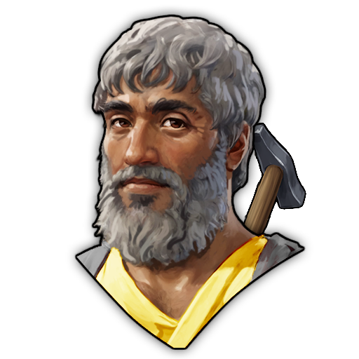 | 1600000357 | Specialist AE-WFMaint-AddGoodsCeresShrine-E | Traveling Worker of Ceres | Chosen by Ceres to assist at her hard work. (Shrine-Pack) | All Ceres Shrines | Area Effect for blessed Chains:  • Factory Output: Adds 2 units of the factory's product every 5 cycles. • Reduces workforce maintenance cost by 25%. |
| 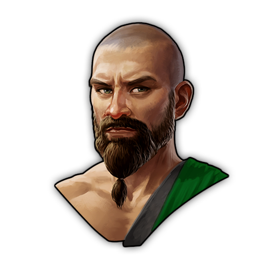 | 1600000361 | Specialist AE-WFMaint-AddGoodsCernunnosShrine-E | Traveling Worker of Cernunnos | Chosen by Cernunnos to assist at his hard work. (Shrine-Pack) | All Cernunnos Shrines | Area Effect for blessed Chains:  • Factory Output: Adds 2 units of the factory's product every 5 cycles. • Reduces workforce maintenance cost by 25%. |
| 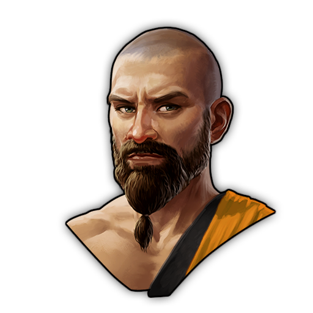 | 1600000365 | Specialist AE-WFMaint-AddGoodsEponaShrine-E | Traveling Worker of Epona | Chosen by Epona to assist at her hard work. (Shrine-Pack) | All Epona Shrines | Area Effect for blessed Chains:  • Factory Output: Adds 2 units of the factory's product every 5 cycles. • Reduces workforce maintenance cost by 25%. |
| 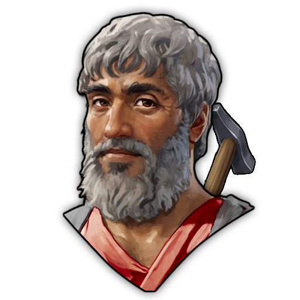 | 1600000369 | Specialist AE-WFMaint-AddGoodsMarsShrine-E | Traveling Worker of Mars | Chosen by Mars to assist at his hard work. (Shrine-Pack) | All Mars Shrines | Area Effect for blessed Chains:  • Factory Output: Adds 2 units of the factory's product every 5 cycles. • Reduces workforce maintenance cost by 25%. |
| 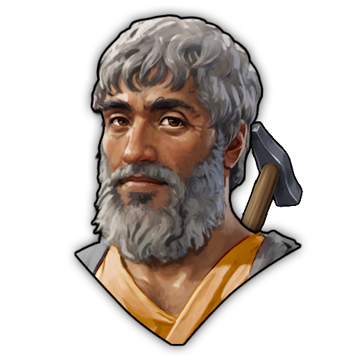 | 1600000373 | Specialist AE-WFMaint-AddGoodsMercuryShrine-E | Traveling Worker of Mercury-Lugus | Chosen by Mercury-Lugus to assist at his hard work. (Shrine-Pack) | All Mercury-Lugus Shrines | Area Effect for blessed Chains (Gold & Silver):  • Factory Output: Adds 2 units of the factory's product every 5 cycles. • Reduces workforce maintenance cost by 25%. |
| 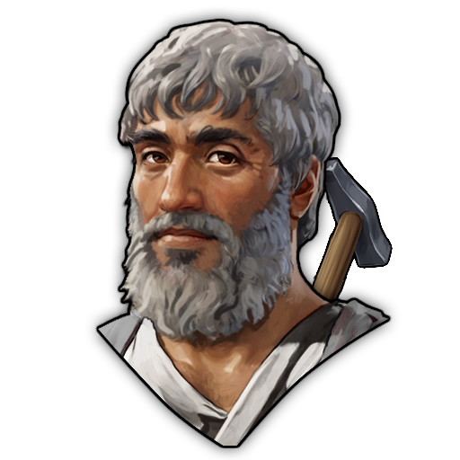 | 1600000377 | Specialist AE-WFMaint-AddGoodsMinervaShrine-E | Traveling Worker of Minerva | Chosen by Minerva to assist at her hard work. (Shrine-Pack) | All Minerva Shrines | Area Effect for blessed Chains:  • Factory Output: Adds 2 units of the factory's product every 5 cycles. • Reduces workforce maintenance cost by 25%. |
| 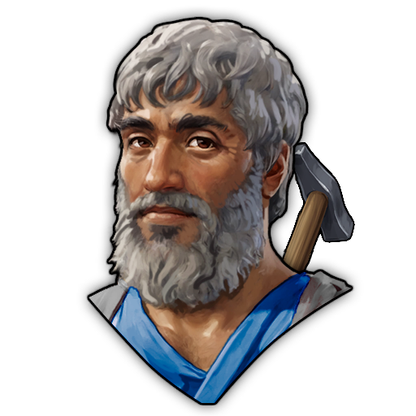 | 1600000381 | Specialist AE-WFMaint-AddGoodsNeptuneShrine-E | Traveling Worker of Neptune | Chosen by Neptune to assist at his hard work. (Shrine-Pack) | All Neptune Shrines | Area Effect for blessed Chains:  • Factory Output: Adds 2 units of the factory's product every 5 cycles. • Reduces workforce maintenance cost by 25%. |
***
### Legendary
| Image Preview | GUID | Internal Name | Itemname | Description | Targets | Base Effects | Boosted Effects | Boost Condition |
| :---: | :---: | :---: | :---: | :---: | :---: | :---: | :---: | :---: |
| 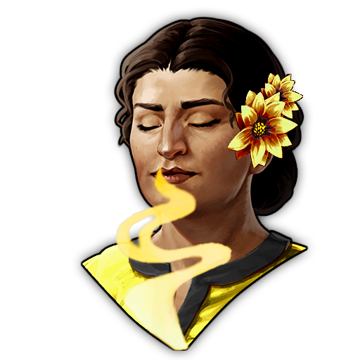 | 1600000439 | Specialist AE-MajorCeresShrine-L | Blessed Follower of Ceres | She has found the blessing of Ceres and manifests it at any shrine of her on the Island. (Shrine-Pack) | All Ceres Shrines | • Area Effect: • +1.5 Health • +1.5 Population | Area Effect: • +3 Health • +3 Population | Have at least 5 Shrines of Ceres active on this Island. |
|  | 1600000446 | Specialist AE-MajorCernunnosShrine-L | Blessed Journeying Druid of Cernunnos | He brings the blessing of Cernunnos and manifests it at any shrine of him on the Island. (Shrine-Pack) | All Cernunnos Shrines | Area Effect: • +1.5 Health • +1.5 Belief | Area Effect: • +3 Health • +3 Belief | Have at least 5 Shrines of Cernunnos active on this Island. |
| 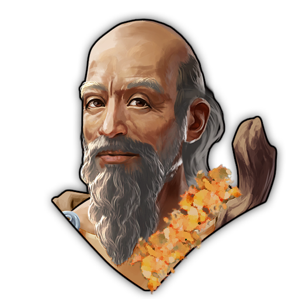 | 1600000453 | Specialist AE-MajorEponaShrine-L | Blessed Journeying Druid of Epona | He brings the blessing of Epona and manifests it at any shrine of her on the Island. (Shrine-Pack) | All Epona Shrines | Area Effect: • +1.5 Happiness • +1.5 Population | Area Effect: • +3 Happiness • +3 Population | Have at least 5 Shrines of Epona active on this Island. |
| 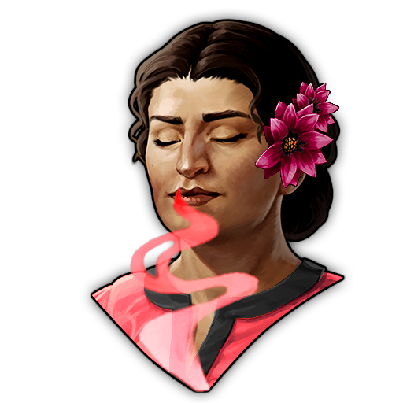 | 1600000460 | Specialist AE-MajorMarsShrine-L | Blessed Follower of Mars | She has found the blessing of Mars and manifests it at any shrine of her on the Island. (Shrine-Pack) | All Mars Shrines | Area Effect: • +1.5 Prestige • +1.5 Population | Area Effect: • +3 Prestige • +3 Population | Have at least 5 Shrines of Mars active on this Island. |
| 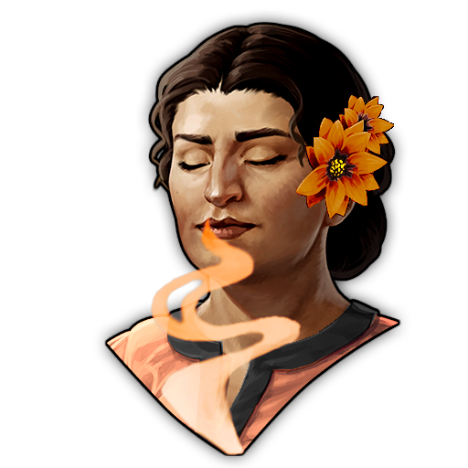 | 1600000467 | Specialist AE-MajorMercuryShrine-L | Blessed Follower of Mercury-Lugus | She has found the blessing of Mercury-Lugus and manifests it at any shrine of her on the Island. (Shrine-Pack) | All Mercury-Lugus Shrines | Area Effect: • +3 Money | Area Effect: • +6 Money | Have at least 5 Shrines of Mercury-Lugus active on this Island. |
| 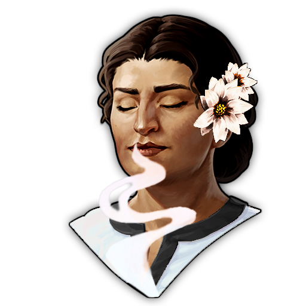 | 1600000474 | Specialist AE-MajorMinervaShrine-L | Blessed Follower of Minerva | She has found the blessing of Minerva and manifests it at any shrine of her on the Island. (Shrine-Pack) | All Minerva Shrines | Area Effect: • +1.5 Prestige • +1.5 Knowledge | Area Effect: • +3 Prestige • +3 Knowledge | Have at least 5 Shrines of Minerva active on this Island. |
| 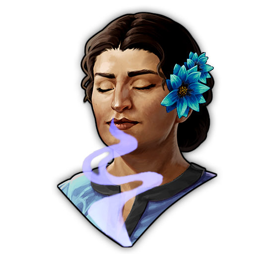 | 1600000481 | Specialist AE-MajorNeptuneShrine-L | Blessed Follower of Neptune | She has found the blessing of Neptune and manifests it at any shrine of her on the Island. (Shrine-Pack) | All Neptune Shrines | Area Effect: • +1.5 Money • +1.5 FireSafety | Area Effect: • +3 Money • +3 FireSafety | Have at least 5 Shrines of Neptune active on this Island. |
